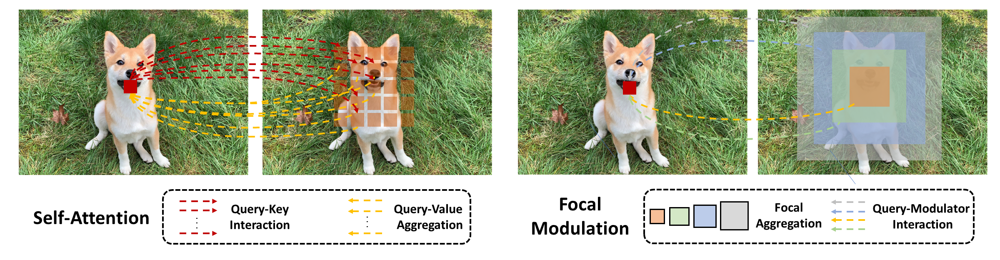
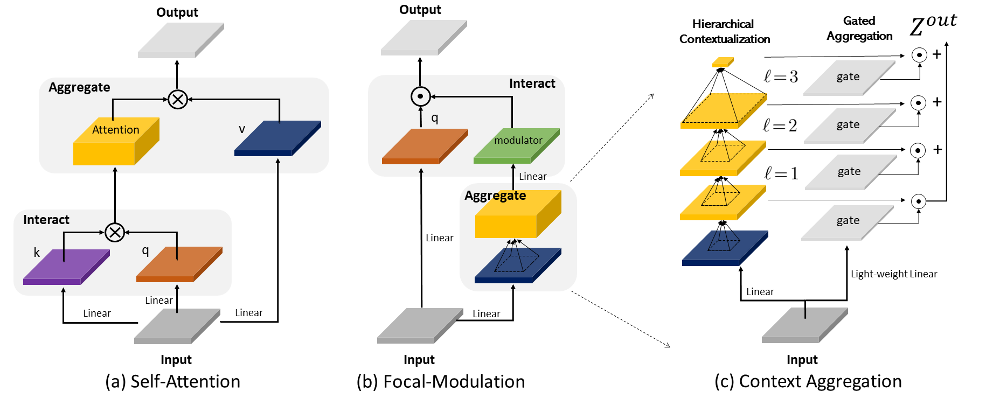
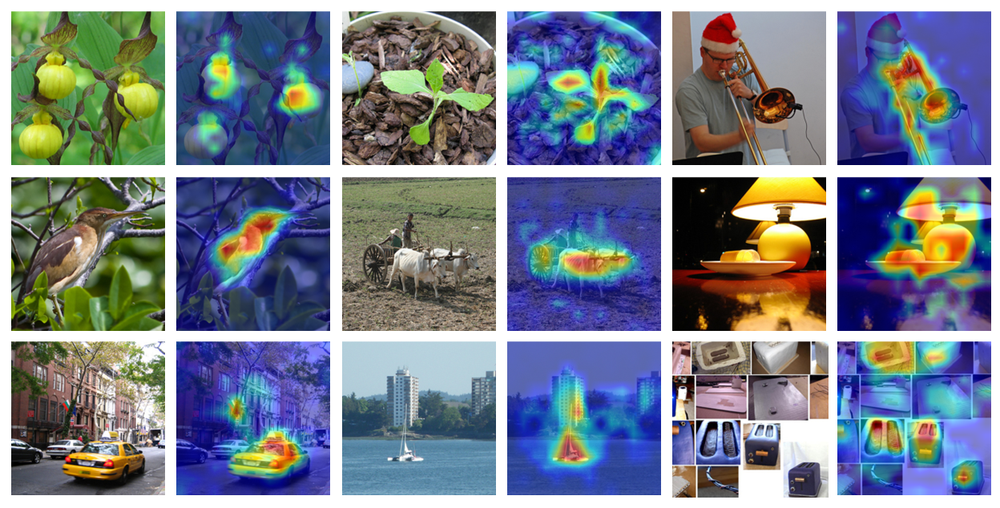
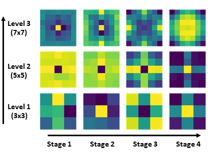
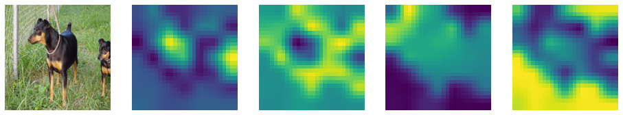
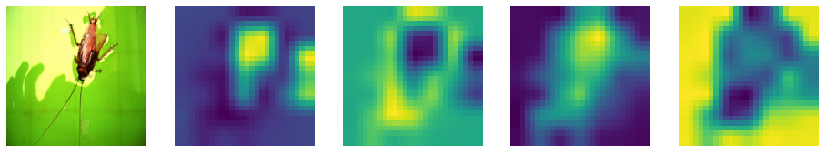
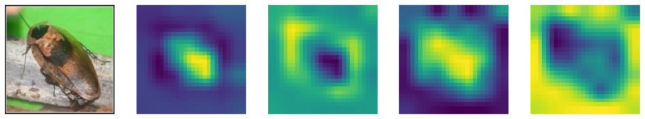
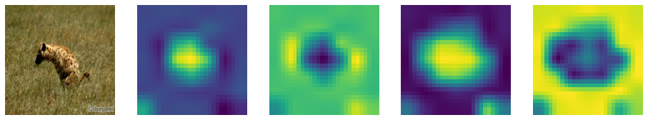
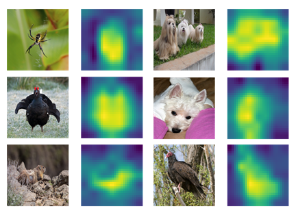

# [Focal Modulation Networks](https://arxiv.org/abs/2203.11926)

This is the official Pytorch implementation of FocalNets:

["**Focal Modulation Networks**"](https://arxiv.org/abs/2203.11926) by [Jianwei Yang](https://jwyang.github.io/), [Chunyuan Li](https://chunyuan.li/), [Xiyang Dai](https://sites.google.com/site/xiyangdai/), [Lu Yuan](https://scholar.google.com/citations?user=k9TsUVsAAAAJ&hl=en) and [Jianfeng Gao](https://www.microsoft.com/en-us/research/people/jfgao/?from=http%3A%2F%2Fresearch.microsoft.com%2Fen-us%2Fum%2Fpeople%2Fjfgao%2F).

## News

* [11/14/2022] We created a new repo [FocalNet-DINO](https://github.com/FocalNet/FocalNet-DINO) to hold the code to reproduce the object detection performance with DINO. We will be releasing the object detection code and checkpoints there. Stay tunned!
* [11/13/2022] :collision: We release our [large, xlarge and huge models](https://github.com/microsoft/FocalNet#imagenet-22k-pretrained) pretrained on ImageNet-22K, including the one we used to achieve the SoTA on COCO object detection leaderboard!
* [11/02/2022] We wrote a [blog post](https://www.microsoft.com/en-us/research/group/deep-learning-group/articles/focalnets-focusing-the-eyes-with-focal-modulation/) to introduce the insights and techniques behind our FocalNets in a plain way, check it out!
* [10/31/2022] :collision: We achieved new SoTA with 64.2 box mAP on [COCO minival](https://paperswithcode.com/sota/object-detection-on-coco-minival) and <strike>64.3</strike> **64.4** box mAP on [COCO test-dev](https://paperswithcode.com/sota/object-detection-on-coco) based on the powerful OD method [DINO](https://github.com/IDEA-Research/DINO)! We used huge model size (700M) beating much larger attention-based models like SwinV2-G and BEIT-3. Checkoout our [new version](./FocalNet_NeurIPS2022_extension.pdf) and stay tuned!
* [09/20/2022] Our FocalNet has been accepted by NeurIPS 2022!
* [04/02/2022] Create a [gradio demo in huggingface space](https://huggingface.co/spaces/jw2yang/focalnet-modulators) to visualize the modulation mechanism. Check it out!

## Introduction

We propose **FocalNets: Focal Modulation Networks**, an **attention-free** architecture that achieves superior performance than SoTA self-attention (SA) methods across various vision benchmarks. SA is an first interaction, last aggregation (FILA) process as shown above. Our Focal Modulation inverts the process by first aggregating, last interaction (FALI). This inversion brings several merits:

* **Translation-Invariance**: It is performed for each target token with the context centered around it.
* **Explicit input-dependency**: The *modulator* is computed by aggregating the short- and long-rage context from the input and then applied to the target token.
* **Spatial- and channel-specific**: It first aggregates the context spatial-wise and then channel-wise, followed by an element-wise modulation.
* **Decoupled feature granularity**: Query token preserves the invidual information at finest level, while coarser context is extracted surrounding it. They two are decoupled but connected through the modulation operation.
* **Easy to implement**: We can implement both context aggregation and interaction in a very simple and light-weight way. It does not need softmax, multiple attention heads, feature map rolling or unfolding, etc.

Before getting started, see what our FocalNets have learned to perceive images and where to modulate!

Finally, FocalNets are built with convolutional and linear layers, but goes beyond by proposing a new modulation mechanism that is simple, generic, effective and efficient. We hereby recommend: 

**Focal-Modulation May be What We Need for Visual Modeling!**

## Getting Started

* Please follow [get_started_for_image_classification](./classification) to get started for image classification.
* Please follow [get_started_for_object_detection](./detection) to get started for object detection.
* Please follow [get_started_for_semantic_segmentation](./segmentation) to get started for semantic segmentation.

## Benchmarking

### Image Classification on [ImageNet-1K](https://www.image-net.org/)

#### ImageNet-1K Pretrained

* Strict comparison with multi-scale Swin and Focal Transformers:

| Model | Depth | Dim | Kernels | #Params. (M) | FLOPs (G) | Throughput (imgs/s) | Top-1 | Download
| :----: | :---: | :---: | :---: | :---: | :--: | :---: | :---: |:---: | 
| FocalNet-T | [2,2,6,2] |96 | [3,5] | 28.4 | 4.4 | 743 | 82.1 | [ckpt](https://projects4jw.blob.core.windows.net/focalnet/release/classification/focalnet_tiny_srf.pth)/[config](configs/focalnet_tiny_srf.yaml)/[log](https://projects4jw.blob.core.windows.net/focalnet/release/classification/log_focalnet_tiny_srf.txt)
| FocalNet-T | [2,2,6,2] | 96 | [3,5,7] | 28.6 | 4.5 | 696 | 82.3 | [ckpt](https://projects4jw.blob.core.windows.net/focalnet/release/classification/focalnet_tiny_lrf.pth)/[config](configs/focalnet_tiny_lrf.yaml)/[log](https://projects4jw.blob.core.windows.net/focalnet/release/classification/log_focalnet_tiny_lrf.txt)
| FocalNet-S | [2,2,18,2] | 96 | [3,5] | 49.9 | 8.6 | 434 | 83.4 | [ckpt](https://projects4jw.blob.core.windows.net/focalnet/release/classification/focalnet_small_srf.pth)/[config](configs/focalnet_small_srf.yaml)/[log](https://projects4jw.blob.core.windows.net/focalnet/release/classification/log_focalnet_small_srf.txt)
| FocalNet-S | [2,2,18,2] | 96 | [3,5,7] | 50.3 | 8.7 | 406 | 83.5 | [ckpt](https://projects4jw.blob.core.windows.net/focalnet/release/classification/focalnet_small_lrf.pth)/[config](configs/focalnet_small_lrf.yaml)/[log](https://projects4jw.blob.core.windows.net/focalnet/release/classification/log_focalnet_small_lrf.txt)
| FocalNet-B | [2,2,18,2] | 128 | [3,5] | 88.1 | 15.3 | 280 | 83.7 | [ckpt](https://projects4jw.blob.core.windows.net/focalnet/release/classification/focalnet_base_srf.pth)/[config](configs/focalnet_base_srf.yaml)/[log](https://projects4jw.blob.core.windows.net/focalnet/release/classification/log_focalnet_base_srf.txt)
| FocalNet-B | [2,2,18,2] | 128 | [3,5,7] | 88.7 | 15.4 | 269 | 83.9 | [ckpt](https://projects4jw.blob.core.windows.net/focalnet/release/classification/focalnet_base_lrf.pth)/[config](configs/focalnet_base_lrf.yaml)/[log](https://projects4jw.blob.core.windows.net/focalnet/release/classification/log_focalnet_base_lrf.txt)

* Strict comparison with isotropic ViT models:

| Model | Depth | Dim | Kernels | #Params. (M) | FLOPs (G) | Throughput (imgs/s) | Top-1 | Download
| :----: | :---: | :---: | :---: | :---: | :---: | :---: | :---: |:---: |
| FocalNet-T | 12 | 192 | [3,5,7] | 5.9 | 1.1 | 2334 | 74.1 | [ckpt](https://projects4jw.blob.core.windows.net/focalnet/release/classification/focalnet_tiny_iso_16.pth)/[config](configs/focalnet_tiny_iso.yaml)/[log](https://projects4jw.blob.core.windows.net/focalnet/release/classification/log_focalnet_tiny_iso.txt)
| FocalNet-S | 12 | 384 | [3,5,7] | 22.4 | 4.3 | 920 | 80.9 | [ckpt](https://projects4jw.blob.core.windows.net/focalnet/release/classification/focalnet_small_iso_16.pth)/[config](configs/focalnet_small_iso.yaml)/[log](https://projects4jw.blob.core.windows.net/focalnet/release/classification/log_focalnet_small_iso.txt)
| FocalNet-B | 12 | 768 | [3,5,7] | 87.2 | 16.9 | 300 | 82.4 | [ckpt](https://projects4jw.blob.core.windows.net/focalnet/release/classification/focalnet_base_iso_16.pth)/[config](configs/focalnet_base_iso.yaml)/[log](https://projects4jw.blob.core.windows.net/focalnet/release/classification/log_focalnet_base_iso.txt)

#### ImageNet-22K Pretrained

| Model | Depth | Dim | Kernels | #Params. (M) | Download
| :----: | :---: | :---: | :---: | :---: | :--: | 
| FocalNet-L | [2,2,18,2] | 192 | [5,7,9] | 207 | [ckpt](https://projects4jw.blob.core.windows.net/focalnet/release/classification/focalnet_large_lrf_384.pth)/[config](configs/focalnet_large_fl3.yaml)
| FocalNet-L | [2,2,18,2] | 192 | [3,5,7,9] | 207 | [ckpt](https://projects4jw.blob.core.windows.net/focalnet/release/classification/focalnet_large_lrf_384_fl4.pth)/[config](configs/focalnet_large_fl4.yaml)
| FocalNet-XL | [2,2,18,2] | 256 | [5,7,9] | 366 | [ckpt](https://projects4jw.blob.core.windows.net/focalnet/release/classification/focalnet_xlarge_lrf_384.pth)/[config](configs/focalnet_xlarge_fl3.yaml)
| FocalNet-XL | [2,2,18,2] | 256 | [3,5,7,9] | 366 | [ckpt](https://projects4jw.blob.core.windows.net/focalnet/release/classification/focalnet_xlarge_lrf_384_fl4.pth)/[config](configs/focalnet_xlarge_fl4.yaml)
| FocalNet-H | [2,2,18,2] | 352 | [3,5,7] | 687 | [ckpt](https://projects4jw.blob.core.windows.net/focalnet/release/classification/focalnet_huge_lrf_224.pth)/[config](configs/focalnet_huge_fl3.yaml)
| FocalNet-H | [2,2,18,2] | 352 | [3,5,7,9] | 689 | [ckpt](https://projects4jw.blob.core.windows.net/focalnet/release/classification/focalnet_huge_lrf_224_fl4.pth)/[config](configs/focalnet_huge_fl4.yaml)

### Object Detection on [COCO](https://cocodataset.org/#home)

* [Mask R-CNN](https://openaccess.thecvf.com/content_ICCV_2017/papers/He_Mask_R-CNN_ICCV_2017_paper.pdf)

| Backbone   | Kernels   | Lr Schd | #Params. (M) | FLOPs (G) | box mAP | mask mAP | Download 
| :---: | :---: | :---:  | :---:   | :---: | :---: | :---: | :---: |
| FocalNet-T | [9,11]    | 1x      | 48.6 | 267 | 45.9 | 41.3 | [ckpt](https://projects4jw.blob.core.windows.net/focalnet/release/detection/focalnet_tiny_srf_maskrcnn_1x.pth)/[config](detection/configs/focalnet/mask_rcnn_focalnet_tiny_patch4_mstrain_480-800_adamw_1x_coco_srf.py)/[log](https://projects4jw.blob.core.windows.net/focalnet/release/detection/log_focalnet_tiny_srf_maskrcnn_1x.json)
| FocalNet-T | [9,11]    | 3x      | 48.6 | 267 | 47.6 | 42.6 | [ckpt](https://projects4jw.blob.core.windows.net/focalnet/release/detection/focalnet_tiny_srf_maskrcnn_3x.pth)/[config](detection/configs/focalnet/mask_rcnn_focalnet_small_patch4_mstrain_480-800_adamw_3x_coco_srf.py)/[log](https://projects4jw.blob.core.windows.net/focalnet/release/detection/log_focalnet_tiny_srf_maskrcnn_3x.json)
| FocalNet-T | [9,11,13] | 1x      | 48.8 | 268 | 46.1 | 41.5 | [ckpt](https://projects4jw.blob.core.windows.net/focalnet/release/detection/focalnet_tiny_lrf_maskrcnn_1x.pth)/[config](detection/configs/focalnet/mask_rcnn_focalnet_tiny_patch4_mstrain_480-800_adamw_1x_coco_lrf.py)/[log](https://projects4jw.blob.core.windows.net/focalnet/release/detection/log_focalnet_tiny_lrf_maskrcnn_1x.json)
| FocalNet-T | [9,11,13] | 3x      | 48.8 | 268 | 48.0 | 42.9 | [ckpt](https://projects4jw.blob.core.windows.net/focalnet/release/detection/focalnet_tiny_lrf_maskrcnn_3x.pth)/[config](detection/configs/focalnet/mask_rcnn_focalnet_tiny_patch4_mstrain_480-800_adamw_3x_coco_lrf.py)/[log](https://projects4jw.blob.core.windows.net/focalnet/release/detection/log_focalnet_tiny_lrf_maskrcnn_3x.json)
| FocalNet-S | [9,11]    | 1x      | 70.8  | 356 | 48.0 | 42.7 | [ckpt](https://projects4jw.blob.core.windows.net/focalnet/release/detection/focalnet_small_srf_maskrcnn_1x.pth)/[config](detection/configs/focalnet/mask_rcnn_focalnet_small_patch4_mstrain_480-800_adamw_1x_coco_srf.py)/[log](https://projects4jw.blob.core.windows.net/focalnet/release/detection/log_focalnet_small_srf_maskrcnn_1x.json)
| FocalNet-S | [9,11]    | 3x      | 70.8  | 356 | 48.9 | 43.6 | [ckpt](https://projects4jw.blob.core.windows.net/focalnet/release/detection/focalnet_small_srf_maskrcnn_3x.pth)/[config](detection/configs/focalnet/mask_rcnn_focalnet_small_patch4_mstrain_480-800_adamw_3x_coco_srf.py)/[log](https://projects4jw.blob.core.windows.net/focalnet/release/detection/log_focalnet_small_srf_maskrcnn_3x.json)
| FocalNet-S | [9,11,13] | 1x      | 72.3  | 365 | 48.3 | 43.1 | [ckpt](https://projects4jw.blob.core.windows.net/focalnet/release/detection/focalnet_small_lrf_maskrcnn_1x.pth)/[config](detection/configs/focalnet/mask_rcnn_focalnet_small_patch4_mstrain_480-800_adamw_1x_coco_lrf.py)/[log](https://projects4jw.blob.core.windows.net/focalnet/release/detection/log_focalnet_small_lrf_maskrcnn_1x.json)
| FocalNet-S | [9,11,13] | 3x      | 72.3  | 365 | 49.3 | 43.8 | [ckpt](https://projects4jw.blob.core.windows.net/focalnet/release/detection/focalnet_small_lrf_maskrcnn_3x.pth)/[config](detection/configs/focalnet/mask_rcnn_focalnet_small_patch4_mstrain_480-800_adamw_3x_coco_lrf.py)/[log](https://projects4jw.blob.core.windows.net/focalnet/release/detection/log_focalnet_small_lrf_maskrcnn_3x.json)
| FocalNet-B | [9,11]    | 1x      | 109.4 | 496 | 48.8 | 43.3 | [ckpt](https://projects4jw.blob.core.windows.net/focalnet/release/detection/focalnet_base_srf_maskrcnn_1x.pth)/[config](detection/configs/focalnet/mask_rcnn_focalnet_base_patch4_mstrain_480-800_adamw_1x_coco_srf.py)/[log](https://projects4jw.blob.core.windows.net/focalnet/release/detection/log_focalnet_base_srf_maskrcnn_1x.json)
| FocalNet-B | [9,11]    | 3x      | 109.4 | 496 | 49.6 | 44.1 | [ckpt](https://projects4jw.blob.core.windows.net/focalnet/release/detection/focalnet_base_srf_maskrcnn_3x.pth)/[config](detection/configs/focalnet/mask_rcnn_focalnet_base_patch4_mstrain_480-800_adamw_3x_coco_srf.py)/[log](https://projects4jw.blob.core.windows.net/focalnet/release/detection/log_focalnet_base_srf_maskrcnn_3x.json)
| FocalNet-B | [9,11,13] | 1x      | 111.4 | 507 | 49.0 | 43.5 | [ckpt](https://projects4jw.blob.core.windows.net/focalnet/release/detection/focalnet_base_lrf_maskrcnn_1x.pth)/[config](detection/configs/focalnet/mask_rcnn_focalnet_base_patch4_mstrain_480-800_adamw_1x_coco_lrf.py)/[log](https://projects4jw.blob.core.windows.net/focalnet/release/detection/log_focalnet_base_lrf_maskrcnn_1x.json)
| FocalNet-B | [9,11,13] | 3x      | 111.4 | 507 | 49.8 | 44.1 | [ckpt](https://projects4jw.blob.core.windows.net/focalnet/release/detection/focalnet_base_lrf_maskrcnn_3x.pth)/[config](detection/configs/focalnet/mask_rcnn_focalnet_base_patch4_mstrain_480-800_adamw_3x_coco_lrf.py)/[log](https://projects4jw.blob.core.windows.net/focalnet/release/detection/log_focalnet_base_lrf_maskrcnn_3x.json)

* Other detection methods

| Backbone | Kernels | Method | Lr Schd | #Params. (M) | FLOPs (G) | box mAP | Download 
| :---: | :---: | :---: | :---: | :---: | :---: | :---: | :---: |
| FocalNet-T | [11,9,9,7] | [Cascade Mask R-CNN](https://arxiv.org/abs/1712.00726) | 3x | 87.1  | 751 | 51.5 | [ckpt](https://projects4jw.blob.core.windows.net/focalnet/release/detection/focalnet_tiny_lrf_cascade_maskrcnn_3x.pth)/[config](detection/configs/focalnet/cascade_mask_rcnn_focalnet_tiny_patch4_mstrain_480-800_adamw_3x_coco_lrf.py)/[log](https://projects4jw.blob.core.windows.net/focalnet/release/detection/log_focalnet_tiny_cascade_maskrcnn_3x.json)
| FocalNet-T | [11,9,9,7] | [ATSS](https://arxiv.org/pdf/1912.02424.pdf)           | 3x | 37.2  | 220 | 49.6 | [ckpt](https://projects4jw.blob.core.windows.net/focalnet/release/detection/focalnet_tiny_lrf_atss_3x.pth)/[config](detection/configs/focalnet/atss_focalnet_tiny_patch4_fpn_3x_coco_lrf.py)/[log](https://projects4jw.blob.core.windows.net/focalnet/release/detection/log_focalnet_tiny_lrf_atss_3x.json)
| FocalNet-T | [11,9,9,7] | [Sparse R-CNN](https://arxiv.org/pdf/2011.12450.pdf)   | 3x | 111.2 | 178 | 49.9 | [ckpt](https://projects4jw.blob.core.windows.net/focalnet/release/detection/focalnet_tiny_lrf_sparsercnn_3x.pth)/[config](detection/configs/focalnet/sparse_rcnn_focalnet_tiny_fpn_300_proposals_crop_mstrain_480-800_3x_coco_lrf.py)/[log](https://projects4jw.blob.core.windows.net/focalnet/release/detection/log_focalnet_tiny_lrf_sparsercnn_3x.json)

### Semantic Segmentation on [ADE20K](https://groups.csail.mit.edu/vision/datasets/ADE20K/)

* Resolution 512x512 and Iters 160k

| Backbone | Kernels  | Method | #Params. (M) | FLOPs (G) | mIoU | mIoU (MS) |  Download 
| :---: | :---: | :---: | :---: | :---: | :---: | :---: | :---: |
| FocalNet-T | [9,11] | [UPerNet](https://arxiv.org/pdf/1807.10221.pdf) | 61  | 944 | 46.5 | 47.2 | [ckpt](https://projects4jw.blob.core.windows.net/focalnet/release/segmentation/focalnet_tiny_srf_upernet_160k.pth)/[config](segmentation/configs/focalnet/upernet_focalnet_tiny_patch4_512x512_160k_ade20k_srf.py)/[log](https://projects4jw.blob.core.windows.net/focalnet/release/segmentation/log_focalnet_tiny_srf_upernet_160k.json)
| FocalNet-T | [9,11,13] | [UPerNet](https://arxiv.org/pdf/1807.10221.pdf)  | 61  | 949 | 46.8 | 47.8 | [ckpt](https://projects4jw.blob.core.windows.net/focalnet/release/segmentation/focalnet_tiny_lrf_upernet_160k.pth)/[config](segmentation/configs/focalnet/upernet_focalnet_tiny_patch4_512x512_160k_ade20k_lrf.py)/[log](https://projects4jw.blob.core.windows.net/focalnet/release/segmentation/log_focalnet_tiny_lrf_upernet_160k.json)
| FocalNet-S | [9,11] | [UPerNet](https://arxiv.org/pdf/1807.10221.pdf) | 83 | 1035 | 49.3 | 50.1 | [ckpt](https://projects4jw.blob.core.windows.net/focalnet/release/segmentation/focalnet_small_srf_upernet_160k.pth)/[config](segmentation/configs/focalnet/upernet_focalnet_small_patch4_512x512_160k_ade20k_srf.py)/[log](https://projects4jw.blob.core.windows.net/focalnet/release/segmentation/log_focalnet_small_srf_upernet_160k.json)
| FocalNet-S | [9,11,13] | [UPerNet](https://arxiv.org/pdf/1807.10221.pdf)  | 84 | 1044 | 49.1 | 50.1 | [ckpt](https://projects4jw.blob.core.windows.net/focalnet/release/segmentation/focalnet_small_lrf_upernet_160k.pth)/[config](segmentation/configs/focalnet/upernet_focalnet_small_patch4_512x512_160k_ade20k_lrf.py)/[log](https://projects4jw.blob.core.windows.net/focalnet/release/segmentation/log_focalnet_small_lrf_upernet_160k.json)
| FocalNet-B | [9,11] | [UPerNet](https://arxiv.org/pdf/1807.10221.pdf) | 124 | 1180 | 50.2 | 51.1 | [ckpt](https://projects4jw.blob.core.windows.net/focalnet/release/segmentation/focalnet_base_srf_upernet_160k.pth)/[config](segmentation/configs/focalnet/upernet_focalnet_base_patch4_512x512_160k_ade20k_srf.py)/[log](https://projects4jw.blob.core.windows.net/focalnet/release/segmentation/log_focalnet_base_srf_upernet_160k.json)
| FocalNet-B | [9,11,13] | [UPerNet](https://arxiv.org/pdf/1807.10221.pdf) | 126 | 1192 | 50.5 | 51.4 | [ckpt](https://projects4jw.blob.core.windows.net/focalnet/release/segmentation/focalnet_base_lrf_upernet_160k.pth)/[config](segmentation/configs/focalnet/upernet_focalnet_base_patch4_512x512_160k_ade20k_lrf.py)/[log](https://projects4jw.blob.core.windows.net/focalnet/release/segmentation/log_focalnet_base_lrf_upernet_160k.json)

## Visualizations

There are three steps in our FocalNets: 
 1. Contexualization with depth-wise conv; 
 2. Multi-scale aggregation with gating mechanism; 
 3. Modulator derived from context aggregation and projection. 

We visualize them one by one.

* **Depth-wise convolution kernels** learned in FocalNets:

Yellow colors represent higher values. Apparently, FocalNets learn to gather more local context at earlier stages while more global context at later stages.

* **Gating maps** at last layer of FocalNets for different input images:

From left to right, the images are input image, gating map for focal level 1,2,3 and the global context. Clearly, our model has learned where to gather the context depending on the visual contents at different locations.

* **Modulator** learned in FocalNets for different input images:

The modulator derived from our model automatically learns to focus on the foreground regions.

For visualization by your own, please refer to [visualization notebook](tools/visualize.ipynb).

## Citation

If you find this repo useful to your project, please consider to cite it with following bib:

    @misc{yang2022focal,
          title={Focal Modulation Networks}, 
          author={Jianwei Yang and Chunyuan Li and Xiyang Dai and Jianfeng Gao},
          journal={Advances in Neural Information Processing Systems (NeurIPS)},
          year={2022}
    }

## Acknowledgement

Our codebase is built based on [Swin Transformer](https://github.com/microsoft/Swin-Transformer) and [Focal Transformer](https://github.com/microsoft/Focal-Transformer). To achieve the SoTA object detection performance, we heavily rely on the most advanced method [DINO](https://github.com/IDEA-Research/DINO) and the advices from the authors. We thank the authors for the nicely organized code!

## Contributing

This project welcomes contributions and suggestions.  Most contributions require you to agree to a
Contributor License Agreement (CLA) declaring that you have the right to, and actually do, grant us
the rights to use your contribution. For details, visit https://cla.opensource.microsoft.com.

When you submit a pull request, a CLA bot will automatically determine whether you need to provide
a CLA and decorate the PR appropriately (e.g., status check, comment). Simply follow the instructions
provided by the bot. You will only need to do this once across all repos using our CLA.

This project has adopted the [Microsoft Open Source Code of Conduct](https://opensource.microsoft.com/codeofconduct/).
For more information see the [Code of Conduct FAQ](https://opensource.microsoft.com/codeofconduct/faq/) or
contact [opencode@microsoft.com](mailto:opencode@microsoft.com) with any additional questions or comments.

## Trademarks

This project may contain trademarks or logos for projects, products, or services. Authorized use of Microsoft 
trademarks or logos is subject to and must follow 
[Microsoft's Trademark & Brand Guidelines](https://www.microsoft.com/en-us/legal/intellectualproperty/trademarks/usage/general).
Use of Microsoft trademarks or logos in modified versions of this project must not cause confusion or imply Microsoft sponsorship.
Any use of third-party trademarks or logos are subject to those third-party's policies.
